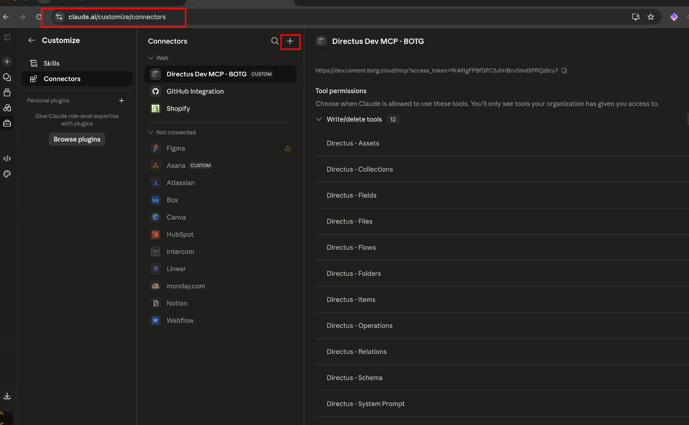
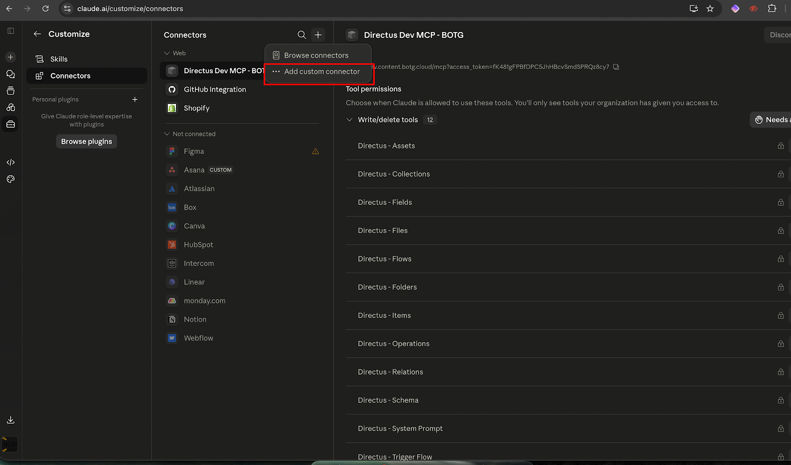
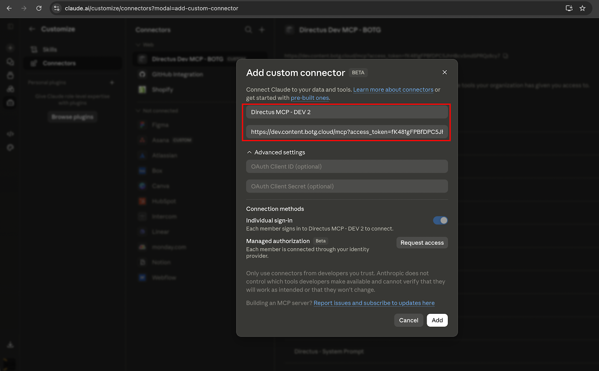
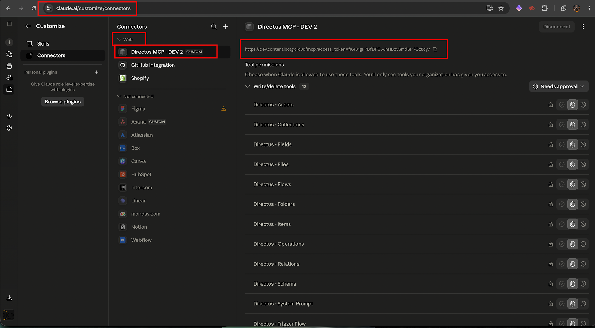

# Quick Start : Connecting Directus to Claude Desktop

Hi there! Here is a step-by-step walkthrough to connect your Directus CMS to Claude Desktop using MCP. Follow each step in order and you'll be up and running in just a few minutes.

> For a full reference guide with all plan types, authentication options, and troubleshooting, see the [complete documentation](./directus-mcp-claude-desktop.md).

---

## Step 1 : Log in to Your Directus Instance and Generate a Token

First, decide which environment you want to connect to and log in.

**Choose your environment:**

| Environment | URL |
| ----------- | --- |
| Production  | https://content.botg.cloud |
| Staging     | https://staging.content.botg.cloud |
| Dev         | https://dev.content.botg.cloud |

> **Not sure which to start with?** We recommend starting with **Dev** or **Staging** to test the connection first, then repeating the steps for Production when you're ready.

**Once logged in:**

1. Click on your **User Avatar / Profile** (bottom-left corner of the sidebar).
2. This opens your user profile page.
3. Scroll all the way down to the **Token** field.
4. Click **Generate Token**.
5. **Copy the token immediately** — it will only be shown once. Paste it into a safe place (e.g. a notes app or password manager).

---

## Step 2 : Build Your Connector URL

Now combine your Directus URL with your token to form the connector URL you will paste into Claude.

**Format:**

```
https://<YOUR_DIRECTUS_URL>/mcp?access_token=<YOUR_TOKEN>
```

**Examples:**

```
# Production
https://content.botg.cloud/mcp?access_token=fK481gFPBfDPC5JhHBcvSmdSPRQz8cy7

# Staging
https://staging.content.botg.cloud/mcp?access_token=fK481gFPBfDPC5JhHBcvSmdSPRQz8cy7

# Dev
https://dev.content.botg.cloud/mcp?access_token=fK481gFPBfDPC5JhHBcvSmdSPRQz8cy7
```

> Replace `fK481gFPBfDPC5JhHBcvSmdSPRQz8cy7` with **your actual token** from Step 1. Keep this URL private — anyone who has it can access your Directus data.

---

## Step 3 : Open Connectors in Claude

Open the **Claude website** (claude.ai) or **Claude Desktop** app and go to your connector settings.

- For **Team and Enterprise plans** : sign in with your **Owner account**, then go to **Settings → Connectors**.
- For **Pro, Max, or Free plans** : go to **Settings → Customize → Connectors**.



---

## Step 4 : Add a New Custom Connector

1. Click the **"+" button** or **"Add custom connector"**.
2. If asked to select a connector type, choose **Web**.
3. A pop-up will appear — this is where you enter your connector details.



---

## Step 5 : Enter the Connector Details and Save

In the pop-up:

1. **Name** : Give it a clear, recognisable name. For example:
   - `Directus – Production`
   - `Directus – Staging`
   - `Directus – Dev`
2. **Server URL** : Paste the full connector URL you built in Step 2.
3. Click the **Add** button.

Claude will verify the connection automatically.



---

## Step 6 : Confirm the Connection

- If the connection is **successful**, your connector will appear in the list and a **permissions tab** will open. Review and accept the permissions — this allows Claude to read and interact with your Directus content.
- If there is an **error**, a warning icon will appear next to the connector name. Double-check your URL and token, remove the connector, and try again from Step 2.



> **Need to update your token?** Claude does not support editing a connector in place. Remove it first, then re-add it with the new URL.

---

## Step 7 : Use the Connector in a Chat

1. Open a **new conversation** in Claude.
2. Click the **"+" button** at the bottom-left of the chat input to enable the connector for this session.
3. Select your Directus connector from the list.
4. Start chatting! Try a prompt like:

```
List the total number of items in the hotels collection.
```

or

```
Show me all published hotels in Directus.
```

Claude will query your Directus data in real time and respond with the results.

---

## Quick Reference

| Step | What you do |
| ---- | ----------- |
| 1    | Log in to Directus → User Profile → Generate Token |
| 2    | Build URL: `https://<directus-url>/mcp?access_token=<token>` |
| 3    | Open Claude → Settings → Connectors |
| 4    | Click + → Add custom connector → Select "Web" |
| 5    | Enter name and URL → Click Add |
| 6    | Accept permissions (or fix the error if a warning shows) |
| 7    | Open a chat → enable the connector → start prompting |

---

## Repeat for Each Environment

If you want to connect **Staging** and **Production** as well, simply repeat Steps 1–6 for each environment using the respective URL and a freshly generated token. We recommend keeping each environment as a **separate named connector** so it's easy to switch.

---

*For full documentation including plan-specific instructions, OAuth setup, and troubleshooting, refer to [directus-mcp-claude-desktop.md](./directus-mcp-claude-desktop.md).*
